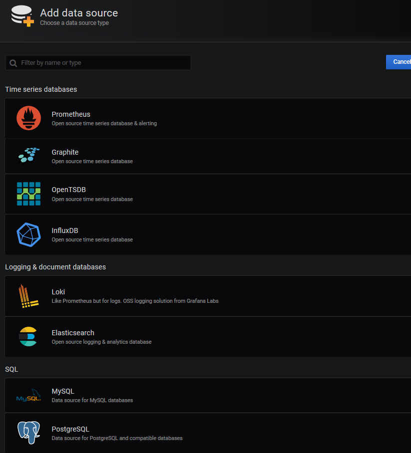
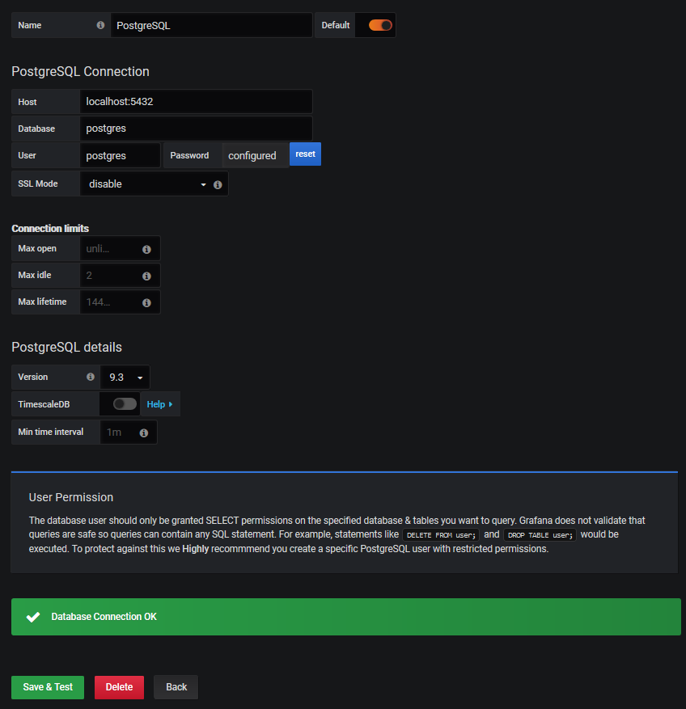

### Datasources

Datasource are what feed your live dashboards, this will guide you through how to configure one to be used.

We will use the popular Postgres database.

CentOS repositories ship with it so in order to install it we need to issue the followin command.

``` bash
yum install postgresql-server postgresql-contrib -y 
```

Once the install is complete we can use the following command to initialize the database.

``` bash
postgresql-setup initdb
```

Then enable and start the service.

``` bash
systemctl enable postgresql
systemctl start postgresql
```

Make sure you set a password for postgres.

``` bash
passwd postgres
```

After this we can change to the user **postgres** and see what kind of databases are available.

``` bash
su - postgres
psql -l
```

Something similar is the output for the default install.

``` bash
                                  List of databases
   Name    |  Owner   | Encoding |   Collate   |    Ctype    |   Access privileges
-----------+----------+----------+-------------+-------------+-----------------------
 postgres  | postgres | UTF8     | en_US.UTF-8 | en_US.UTF-8 |
 template0 | postgres | UTF8     | en_US.UTF-8 | en_US.UTF-8 | =c/postgres          +
           |          |          |             |             | postgres=CTc/postgres
 template1 | postgres | UTF8     | en_US.UTF-8 | en_US.UTF-8 | =c/postgres          +
           |          |          |             |             | postgres=CTc/postgres
```

Let's change the password for the user.

``` bash
su - postgres
psql -d template1 -c "ALTER USER postgres WITH PASSWORD 'postgres';"
```

If we want to change the default address and port on which the server is listening we should edit this file.

**/var/lib/pgsql/data/postgresql.conf**

And change these configuration items.

``` bash 
# listen_addresses = 'localhost'
# port = 5432
```

We will need to edit the following file to allow PgAdmin to access our server.

**/var/lib/pgsql/data/pg_hba.conf**

Add this line.

``` bash
host  all  all 0.0.0.0/0 md5
local   all             all                                     peer
host    all             all             127.0.0.1/32            password
host    all             all             ::1/128                 password
host  all  all 0.0.0.0/0 md5
```

Finally as root restart the postgres server.

``` bash
systemctl restart postgresql
```

On the grafana we go to add datasource and select postgresql.



Then fill the form this way.

