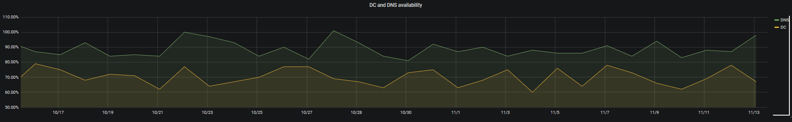

### Initialize table and fill it with data.

In order to interact with the postgres DB we need to prepare the environment.

The following packages should be installed.

``` bash 
yum install postgresql-libs -y 
yum install postgresql-devel -y 
yum install python-devel -y 
```

Then we need to install the **psycopg2** python module. You will need to have python 3.7 installed.

``` bash
python3.7 -m pip install psycopg2
```

Then we can test the connection.

``` python
import psycopg2
con = psycopg2.connect(database="postgres", user="postgres", password="postgres", host="127.0.0.1", port="5432")
```

If no error is thrown you are connected to the database.

Now we would like to create a table which will be visualized in grafana.

``` python
cur = con.cursor()
cur.execute('''CREATE TABLE public."Statistics"
(
    "Device" text COLLATE pg_catalog."default" NOT NULL,
    "Availability" double precision NOT NULL,
    "TimeStamp" date NOT NULL
)
WITH (
    OIDS = FALSE
)
TABLESPACE pg_default;

ALTER TABLE public."Statistics"
    OWNER to postgres;''')
con.commit()
```

Let's insert some data. We have **DC** and **DNS** named devices. We craft random numbers between 80 and 100, then generate 100 date points.

``` python
import datetime
import random

base = datetime.datetime.today()
date_list = [base - datetime.timedelta(days=x) for x in range(100)]

for device in ['DC']:
    for date in date_list:
        av = random.randint(60,81) 
        cur.execute(f""" INSERT INTO public."Statistics" ("Device","Availability","TimeStamp") VALUES ('%s', '%s', '%s') """%(device,av,date));

for device in ['DNS']:
    for date in date_list:
        av = random.randint(81,101) 
        cur.execute(f""" INSERT INTO public."Statistics" ("Device","Availability","TimeStamp") VALUES ('%s', '%s', '%s') """%(device,av,date));

con.commit()
```

Now let's draw some dashboards. This is the query we are going to use!

``` bash
SELECT
  "TimeStamp" AS "time",
  "Device" AS """Device""",
  "Availability" AS """Availability"""
FROM "Statistics"
WHERE
  $__timeFilter("TimeStamp")
GROUP BY "Device", "Availability", "TimeStamp"
ORDER BY 1
```

Once we are done the following dashboard will be presented.


