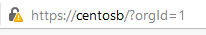

### Securing with https.

Make sure your firewalld is stopped to perform these activities.

First we need to generate an certificate, we should place them under the **/etc/grafana/** folder.

``` bash
openssl req -x509 -newkey rsa:4096 -keyout key.pem -out cert.pem -days 365
```

We will need to issue a password during generation.

By using these pem files we would have two problems, the first is permission error as we did this with  root user.
The second is the following error message when we restart grafana.

In order to get rid of the permission error we need to change the owner of these files.

``` bash
chown grafana.grafana key.pem
chown grafana.grafana cert.pem
```

Now the following error will happen if we use these pem files.

``` bash
msg="Stopped HTTPServer" logger=server reason="tls: failed to parse private key"
```

In order to resolve this we need to use the following commands.

``` bash
openssl rsa -in key.pem -out kkey.pem
chown grafana.grafana kkey.pem
```

Now we can configure our **grafana.ini** file.

We need to swap these lines.

``` bash

# Protocol (http, https, h2, socket)
;protocol = http

# The http port  to use
;http_port = 3000

# https certs & key file
;cert_file =
;cert_key = 
```

To look like these.

``` bash
# Protocol (http, https, h2, socket)
protocol = https

# The http port  to use
http_port = 443

# https certs & key file
cert_file =/etc/grafana/cert.pem
cert_key = /etc/grafana/key.pem
```

Finally restart the server.

``` bash
systemctl restart grafana-server
```

Now we can login with the [htttps://host](http://host) url. Bu it will throw a self signed certificate error.



## Securing with CertBot

If you would like you can use [CertBOT](https://certbot.eff.org/lets-encrypt/centosrhel7-apache) to grab a valid SSL certificate.
