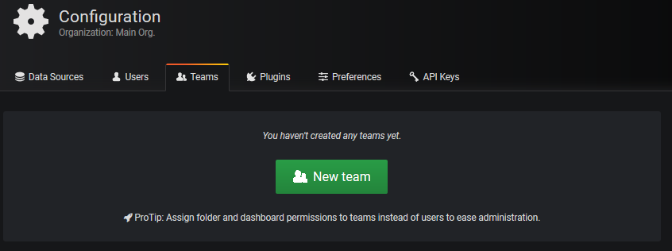
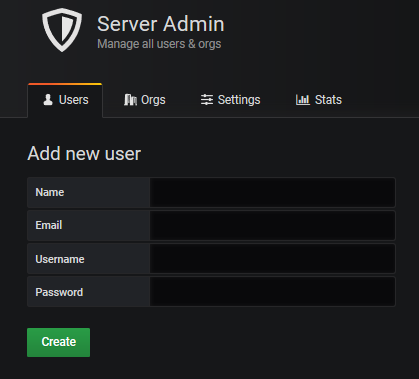

### User management

Grafana allows you to have teams created to groups specific users and assign privileges to dashboards.

If you are logged in with the administrator you have the options to create users, or if you have smtp setup you can send out invites.

Grafana also supports